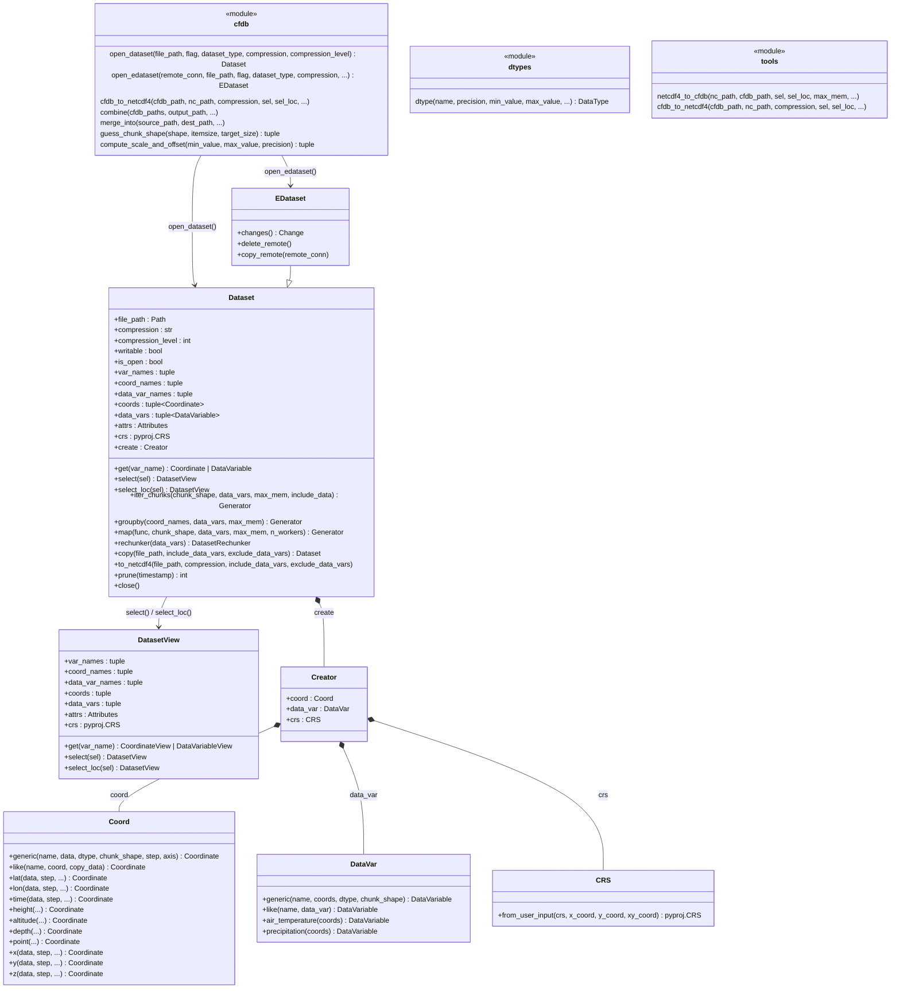
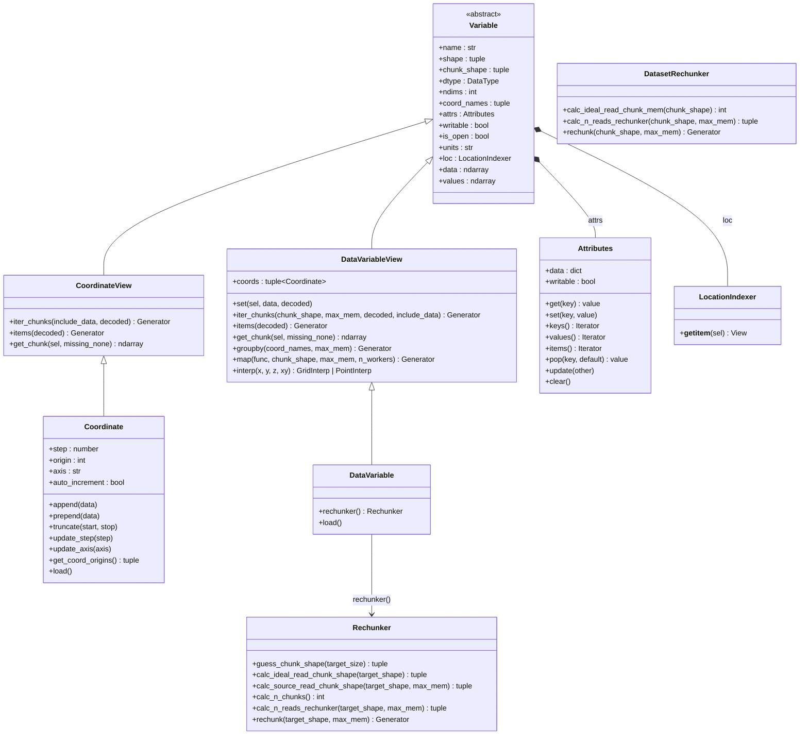
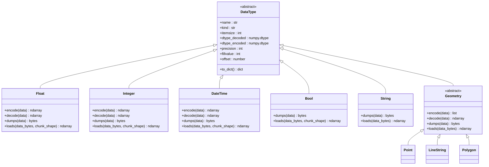

# Architecture

This page explains the internal design of cfdb for users who want to understand how data is stored and managed.

## System Overview

```
open_dataset() / open_edataset()
        │
        ▼
    Dataset / EDataset
        │
        ├── SysMeta (system metadata in Booklet metadata field)
        │     ├── dataset_type, compression, crs
        │     └── variables: dict of CoordinateVariable / DataVariable
        │
        ├── Creator (coord, data_var, crs sub-objects)
        │
        ├── Attributes (JSON dict stored as Booklet key)
        │
        ├── DatasetRechunker (synchronized multi-variable rechunkit wrapper)
        │
        └── Variable objects (Coordinate / DataVariable)
              ├── DataType (encoding/decoding)
              ├── Compressor (zstd/lz4)
              └── Rechunker (single-variable rechunkit wrapper)
```

## Public API

### Datasets



### Variables



### Data Types



## Booklet Storage

cfdb uses [Booklet](https://github.com/mullenkamp/booklet) as a key-value store. Booklet is a persistent dict-like database stored in a single file, with support for thread locks and file locks.

All data in a cfdb file lives in one Booklet file:

- **System metadata** — stored in Booklet's metadata field (a single JSON blob)
- **Data chunks** — stored as Booklet key-value pairs
- **Attributes** — stored as separate Booklet keys (`_{var_name}.attrs`)

## Metadata Lifecycle

1. On open, `SysMeta` is deserialized from the Booklet metadata via `msgspec.convert()`
2. During the session, `SysMeta` is modified in memory (adding variables, changing shapes, etc.)
3. On close, a `weakref.finalize` callback serializes `SysMeta` back to Booklet metadata

This means metadata changes are batched and written on close, not on every operation.

## Chunk Storage

Data chunks are stored with keys formatted as:

```
{var_name}!{dim0_start},{dim1_start},...
```

For example, a 2-D variable `temperature` with chunk starting at position (100, 200) would have the key `temperature!100,200`.

This key format is generated by `utils.make_var_chunk_key()`.

## Variable Hierarchy

```
Variable (base)
├── CoordinateView → Coordinate
│     - Holds all data in memory
│     - Supports append/prepend
│     - .data returns full array
│
└── DataVariableView → DataVariable
      - Never holds full data in memory
      - Supports __setitem__ for writing
      - .data reads all chunks (expensive)
```

The `View` variants represent subsets created by indexing or `select()`.

## Thread and Multiprocess Safety

- **Thread safety**: Booklet uses thread locks for concurrent read/write access
- **Multiprocess safety**: File locks prevent corruption from multiple processes
- **S3 safety** (EDataset): Object locking on the remote ensures consistency

## Error Handling

When an error occurs, cfdb attempts to:

1. Close the Booklet file properly
2. Remove file/object locks

Changes that were not synced are lost. The `weakref.finalize` mechanism ensures cleanup runs even on unexpected exits.

## Dependencies

| Package | Role |
|---------|------|
| booklet | Local key-value file storage |
| ebooklet | S3 remote sync (optional) |
| numpy | Array operations |
| msgspec | Fast serialization (metadata, strings, geometry) |
| zstandard | Zstd compression |
| lz4 | LZ4 compression |
| rechunkit | Rechunking algorithms |
| shapely | Geometry types (WKT conversion) |
| pyproj | CRS handling |
| cfdb-models | Shared data model types |
| cfdb-vars | Variable definitions and templates |
| geointerp | Grid interpolation and CRS transformation |
| h5netcdf | NetCDF4 I/O (optional) |
| xarray | Xarray backend integration (optional) |
